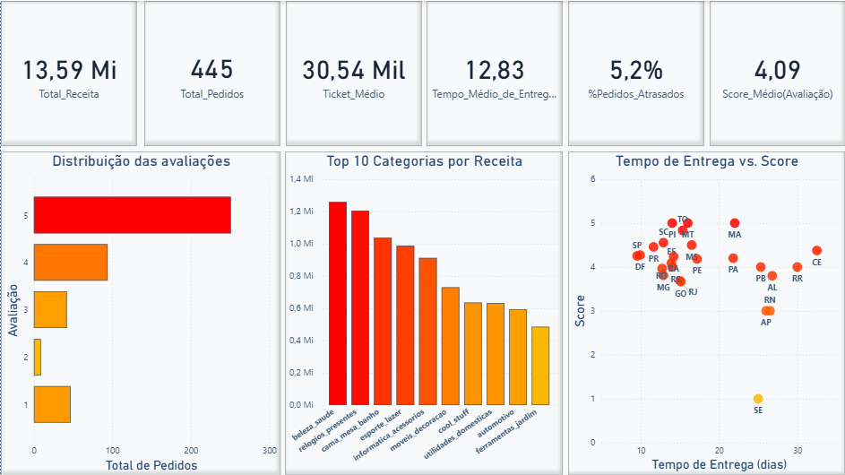
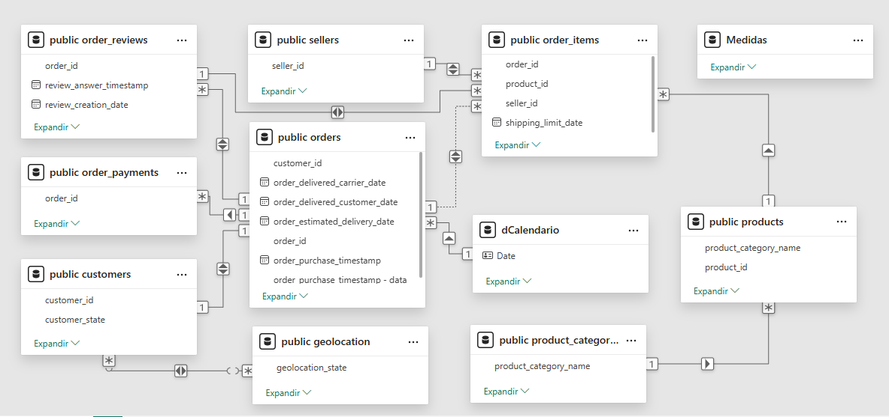

# 📦 Projeto Completo de Engenharia e Análise de Dados de E-Commerce (Olist)

## 🎯 Objetivo

Este projeto ponta-a-ponta de Engenharia e Análise de Dados teve como objetivo transformar um conjunto de dados brutos de e-commerce da Olist em um modelo de dados relacional e, a partir dele, gerar insights estratégicos através de dashboards interativos.

O foco foi analisar a performance de vendas, a eficiência da logística de entrega e a satisfação do cliente para identificar gargalos operacionais e oportunidades de crescimento.

## 📊 Dashboards Finais (Power BI)

Os insights do projeto foram consolidados em dois dashboards interativos no Power BI, que consomem os dados diretamente do banco de dados PostgreSQL.

### **Dashboard 1: Visão Geral de Vendas e Logística**
Painel macro que monitora a saúde financeira e operacional do negócio, com foco em receita, performance de entrega e distribuição geográfica das vendas.

### **Dashboard 2: Análise de Clientes e Satisfação**
Painel focado na "voz do cliente", correlacionando o tempo de entrega com a nota de satisfação e analisando o desempenho das categorias de produtos e vendedores.

---

## 🛠️ Arquitetura e Ferramentas

O projeto foi estruturado em duas etapas principais, utilizando as seguintes tecnologias:

### **1. Engenharia de Dados (ETL)**
*   **Linguagem:** Python
*   **Bibliotecas:** `Pandas` para extração e transformação dos 9 arquivos `.csv`; `SQLAlchemy` para criar a engine de conexão e carregar os dados tratados.
*   **Banco de Dados:** PostgreSQL, utilizado como um Data Warehouse centralizador para armazenar os dados limpos e estruturados.

### **2. Business Intelligence (BI)**
*   **Ferramenta de Visualização:** Power BI Desktop
*   **Conexão de Dados:** Power Query, para importar os dados do PostgreSQL em tempo real.
*   **Linguagem de Medidas:** DAX (Data Analysis Expressions), para criar os KPIs e métricas de negócio.

## ⚙️ Processo de ETL (Engenharia de Dados)

O script `etl.py` automatiza todo o fluxo de engenharia de dados, seguindo as etapas clássicas de ETL:

1.  **Extração (Extract):** Carregamento dos 9 arquivos `.csv` do dataset Olist em DataFrames do Pandas.
2.  **Transformação (Transform):**
    *   **Limpeza:** Padronização de strings, remoção de espaços e tratamento de inconsistências.
    *   **Conversão de Tipos:** Ajuste de colunas de texto para formatos de data (`datetime`), garantindo a correta utilização em cálculos de tempo.
    *   **Enriquecimento de Dados:** Criação de chaves estrangeiras na tabela fato (`order_items`) para viabilizar a construção do modelo relacional.
3.  **Carga (Load):**
    *   Utilização do SQLAlchemy para estabelecer a conexão com o banco de dados PostgreSQL.
    *   Carregamento dos DataFrames tratados como tabelas no banco de dados, prontas para serem consumidas pela ferramenta de BI.

## 🗃️ Modelo de Dados (Esquema Floco de Neve)

Os dados foram modelados no Power BI seguindo um **Esquema Floco de Neve (Snowflake Schema)**. Este modelo foi escolhido devido à normalização de algumas dimensões, o que ajuda a reduzir a redundância de dados.

*   A tabela fato principal `public_order_items` (que contém os itens de cada pedido) se conecta a dimensões que, por sua vez, se conectam a outras, como:
    *   `public_products` -> `product_category_name`
    *   `public_orders` -> `public_customers` -> `public_geolocation`

---

## 💹 KPIs Estratégicos Desenvolvidos (Medidas DAX)

Para traduzir os dados em indicadores de performance, as seguintes medidas DAX foram criadas:

*   **Tabela Calendário (`dCalendario`)**: Tabela calculada para permitir análises de Time Intelligence de forma robusta.
*   **Receita Total**: Soma do valor total dos itens vendidos (`SUM(order_items[price])`).
*   **Total de Pedidos**: Contagem distinta de pedidos únicos (`DISTINCTCOUNT(orders[order_id])`).
*   **Ticket Médio**: Valor médio por pedido (`DIVIDE([Receita Total], [Total de Pedidos])`).
*   **Valor Total de Frete**: Soma de todos os custos de frete (`SUM(order_items[freight_value])`).
*   **Score Médio de Avaliação**: Média das notas de satisfação dadas pelos clientes (`AVERAGE(order_reviews[review_score])`).
*   **Tempo Médio de Entrega (Dias)**: Média de dias decorridos entre a data da compra e a data de entrega.
*   **% de Pedidos Entregues com Atraso**: Percentual de pedidos cuja entrega ocorreu após a data estimada.

---

## 💡 Insights (Análise Quantitativa)

A análise dos dashboards revelou os seguintes pontos-chave sobre a operação:

1.  **Concentração Geográfica de Vendas:** A receita é majoritariamente concentrada na região **Sudeste**, com o estado de São Paulo (`SP`) sendo o principal mercado. Isso indica uma grande oportunidade para expansão em outras regiões.

2.  **Logística como Principal Gargalo:** O **Tempo Médio de Entrega** é um fator crítico. Foi identificado que o maior atraso ocorre no *lead time* (tempo entre a aprovação do pedido e o envio para a transportadora).

3.  **Impacto do Atraso na Satisfação:** Existe uma **correlação direta e forte** entre pedidos entregues com atraso e avaliações negativas (notas 1 e 2). A principal reclamação dos clientes não é a qualidade do produto, mas sim a demora na entrega.

4.  **Predominância do Cartão de Crédito:** O Cartão de Crédito (`credit_card`) é o método de pagamento preferido, seguido pelo Boleto Bancário (`boleto`), que representa uma fatia relevante das transações.

5.  **Concentração de Vendedores:** Assim como os clientes, os vendedores (`sellers`) também estão concentrados no Sudeste. Isso impacta diretamente o custo e o tempo de frete para outras regiões, criando uma barreira para a expansão nacional.

---

## 🧭 Recomendações Estratégicas

Com base nos insights, foram propostas as seguintes ações para otimizar a operação e impulsionar o crescimento:

### **🚨 Ações Críticas (Foco em Logística)**

1.  **Otimizar o "Lead Time" de Postagem:**
    *   **Problema:** Lentidão dos vendedores para despachar os produtos.
    *   **Recomendação:** Implementar um SLA (Acordo de Nível de Serviço) rigoroso para o tempo de postagem. Desenvolver um dashboard interno para monitorar os vendedores com pior performance e criar um sistema de incentivo (ou penalidade).

2.  **Gerenciamento Proativo de Atrasos:**
    *   **Problema:** Atrasos na entrega geram clientes detratores.
    *   **Recomendação:** Criar um sistema de alerta para identificar pedidos com alto risco de atraso (baseado na rota e no histórico da transportadora) e comunicar proativamente o cliente, oferecendo um benefício (ex: cupom de desconto) para mitigar a frustração.

### **📈 Oportunidades de Crescimento**

3.  **Regionalização dos Vendedores:**
    *   **Oportunidade:** Reduzir o custo e o tempo de frete para as regiões Norte, Nordeste e Sul.
    *   **Recomendação:** Criar uma campanha de incentivo para atrair vendedores de outras regiões, transformando-os em "hubs" logísticos locais. Isso tornaria os preços mais competitivos e a entrega mais rápida fora do Sudeste.

4.  **Otimização da Conversão de Boletos:**
    *   **Oportunidade:** Muitos boletos gerados não são pagos, o que "prende" o estoque e reduz a conversão de vendas.
    *   **Recomendação:** Implementar um sistema automatizado de lembretes (via E-mail ou WhatsApp) 24 horas antes do vencimento do boleto, com um link direto para o pagamento.

---

## 📊 Fonte dos Dados

Os dados utilizados neste projeto são públicos e foram disponibilizados pela Olist no Kaggle.
*   **Link do Dataset**: [Olist Brazilian E-Commerce Public Dataset](https://www.kaggle.com/datasets/olistbr/brazilian-ecommerce)
