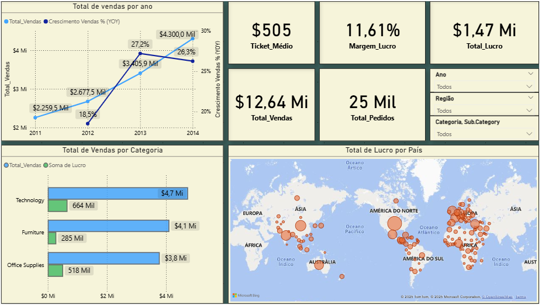
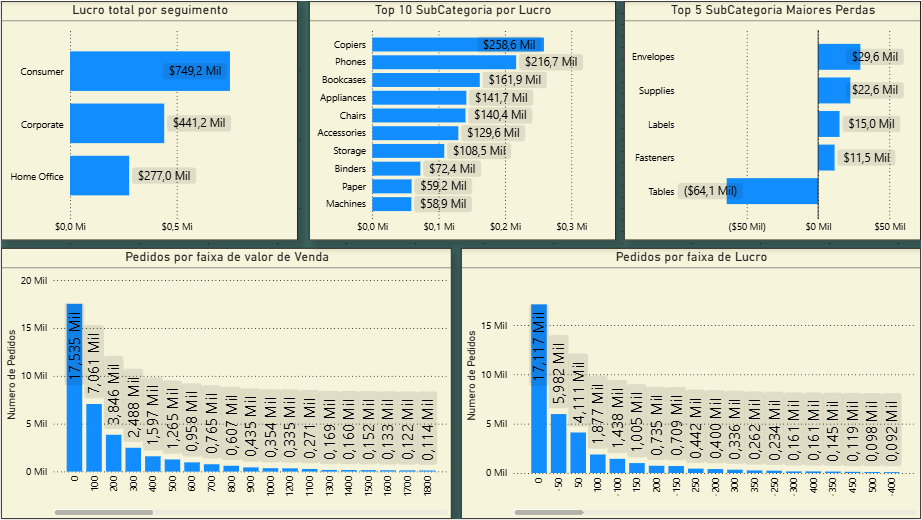

# 📈 Dashboard Análise de Vendas Globais "Global Superstore Dataset"

## 🎯 Descrição do Projeto
Projeto de Business Intelligence para analisar dados de vendas, validar KPIs e identificar tendências geográficas e de produtos. O objetivo é transformar dados brutos em insights acionáveis, permitindo a análise de performance por região, categoria, segmento e tendências temporais.

## 🛠️ Ferramentas Utilizadas
* **Power BI Desktop**: Para modelagem de dados e criação das visualizações.
* **Power Query (Editor M)**: Para extração, transformação e limpeza (ETL) dos dados brutos.
* **DAX (Data Analysis Expressions)**: Para a criação das métricas e KPIs de negócio.

## 📊 Fonte dos Dados
Os dados utilizados são um conjunto de dados público de vendas globais, disponível no Kaggle:
* **Global Superstore Dataset**: https://www.kaggle.com/datasets/fatihilhan/global-superstore-dataset/

## 💹 KPIs Desenvolvidos (Medidas DAX)
Com base nos visuais do dashboard, as seguintes medidas DAX principais foram criadas para possibilitar a análise:

* **Tabela `dCalendario`**: A base para toda a análise de tempo. Uma tabela calculada em DAX para permitir filtros de data consistentes e cálculos de inteligência de tempo.

* **Total Vendas**: Medida principal que soma a receita (`SUM(superstore[Sales])`). É usada em quase todos os visuais, incluindo o mapa, os gráficos de rosca (por Segmento, Categoria) e o gráfico de barras.

* **Vendas (Ano Anterior)**: Medida de inteligência de tempo (`CALCULATE + SAMEPERIODLASTYEAR`) usada como base para o cálculo de crescimento.

* **Crescimento Vendas % (YOY)**: A linha preta no gráfico de barras/linhas superior. Esta medida (`DIVIDE`) calcula a variação percentual das vendas em relação ao mesmo período do ano anterior.

* **Total Lucro**: Medida que soma a coluna de lucro (`SUM(superstore[Profit])`).

* **Margem de Lucro %**: Medida que calcula a lucratividade percentual, usando a fórmula segura `DIVIDE([Total Lucro], [Total Vendas])`.

## 💡 Análise Quantitativa
Uma análise mais profunda dos dados revela os seguintes insights principais:

📈 Dashboard 1: Visão Geral Executiva

Este painel fornece uma visão macro do desempenho da empresa, focando em vendas, crescimento, lucratividade e distribuição geográfica.

1. Total de vendas por ano
Observação: O gráfico de linhas duplas "Total de Vendas por Ano" demonstra um crescimento robusto nas vendas, passando de $2,26 Milhões em 2011 para $4,30 Milhões em 2014. O Crescimento Percentual de Vendas (YOY) atingiu seu pico em 2013 (27,2%), com uma leve desaceleração em 2014 (26,3%), embora as vendas totais continuassem a subir.

2. Indicadores-Chave de Desempenho (KPIs)
Observação: Os cartões de KPI resumem a saúde geral do negócio. Com Vendas Totais de $12,64 Milhões e um Lucro Total de $1,47 Milhão, a empresa opera com uma Margem de Lucro de 11,61%. Isso foi alcançado através de 25 Mil Pedidos, resultando em um Ticket Médio de $505.

3. Total de Vendas por Categoria
Observação: O gráfico "Total de Vendas por Categoria" revela uma visão crucial da lucratividade.

Tecnologia: É a categoria mais forte, liderando tanto em Vendas ($4,7 Mi) quanto em Lucro ($664 Mil).

Móveis: Apresenta altas vendas ($4,1 Mi), mas uma lucratividade comparativamente baixa ($285 Mil).

Material de Escritório: Tem as menores vendas ($3,8 Mi), mas é a segunda categoria mais lucrativa ($518 Mil), indicando uma margem de lucro saudável.

4. Total de Lucro por País
Observação: O mapa "Total de Lucro por País" mostra que os maiores centros de lucro estão concentrados na América do Norte e na Europa. Existem também contribuições significativas de países da Ásia e da Austrália, enquanto América do Sul e África representam mercados com menor lucratividade.

📊 Dashboard 2: Análise de Lucratividade e Pedidos

Este painel aprofunda a análise de lucro, identificando os segmentos e subcategorias mais e menos rentáveis, e também examina a distribuição dos pedidos.

1. Lucro total por seguimento
Observação: O gráfico "Lucro total por seguimento" identifica o segmento de 'Consumidor' como o mais lucrativo, gerando $749,2 Mil em lucro. Os segmentos 'Corporativo' e 'Home Office' seguem com $441,2 Mil e $277,0 Mil, respectivamente.

2. Top 10 SubCategoria por Lucro
Observação: O gráfico "Top 10 SubCategoria por Lucro" aponta 'Copiadoras' e 'Telefones' como os principais impulsionadores de lucro, com $258,6 Mil e $216,7 Mil. O restante do top 10 contribui com lucros positivos, mas em menor escala.

3. Top 5 SubCategoria Maiores Perdas
Observação: Este é um gráfico de alerta crítico. "Top 5 SubCategoria Maiores Perdas" expõe que a subcategoria 'Mesas' é a maior fonte de prejuízo da empresa, com ($64,1 Mil) em perdas. Outras categorias como 'Envelopes', 'Suprimentos', 'Etiquetas' e 'Fixadores' também operam com prejuízo significativo.

4. Pedidos por faixa de valor de Venda
Observação: O histograma "Pedidos por faixa de valor de Venda" ilustra uma distribuição de cauda longa. A grande maioria dos pedidos (17.535) possui um valor de venda baixo, concentrado na faixa de $0 a $100. O número de pedidos diminui drasticamente à medida que o valor da venda aumenta.

5. Pedidos por faixa de Lucro
Observação: De forma similar ao gráfico de vendas, "Pedidos por faixa de Lucro" mostra que a maioria dos pedidos (17.117) gera um lucro pequeno (entre $0 e $50). No entanto, um número alarmante de pedidos (4.111) opera com prejuízo (na faixa de -$50 a $0), o que se conecta diretamente aos problemas identificados no gráfico de "Maiores Perdas".

🧭 Recomendações Estratégicas de Negócios
Aqui estão ações práticas baseadas nos insights dos dashboards para corrigir perdas, maximizar lucros e otimizar a operação.

🚨 Ações Críticas (Correção de Perdas)
Estas são as áreas de maior prioridade que estão ativamente prejudicando a lucratividade da empresa.

1. Investigar a Subcategoria 'Tables' (Mesas) Imediatamente:

Problema: Esta é a maior fonte de prejuízo da empresa, com uma perda de $64,1 Mil.

Recomendação: Realizar uma auditoria completa nesta subcategoria. Analise a estrutura de custos, preços de fornecedores, custos de frete (mesas são volumosas e caras para enviar) e a política de preços. Se a rentabilidade não puder ser recuperada, considere renegociar com fornecedores ou até mesmo descontinuar esta linha de produtos.

2. Resolver o Problema dos Pedidos Não Rentáveis:

Problema: Existem 4.111 pedidos que geram lucro negativo (entre -$50 e $0). Isso está diretamente ligado às subcategorias que dão prejuízo ('Mesas', 'Envelopes', 'Su´Suprimentos', etc.).

Recomendação: Implementar estratégias para aumentar o valor agregado desses pedidos. Considere criar "kits" ou "bundles", onde produtos de prejuízo (como 'Etiquetas') sejam vendidos junto com produtos de alta margem (como 'Phones'). Avalie a implementação de um valor mínimo de pedido para frete grátis, incentivando o cliente a adicionar mais itens e diluindo o custo fixo do pedido.

📈 Oportunidades de Crescimento (Maximizar Ganhos)
Estas são as áreas de alto desempenho que devem receber mais investimento e foco.

3. Dobrar o Foco no Segmento 'Consumidor':

Oportunidade: O segmento 'Consumidor' é, de longe, o mais lucrativo ($749,2 Mil).

Recomendação: Aumente os investimentos em marketing e campanhas direcionadas a este público. Entenda quais produtos eles mais compram (provavelmente 'Copiadoras' e 'Smartphones') e crie ofertas personalizadas para incentivar a recompra e aumentar a fidelidade.

4. Impulsionar as Vendas de 'Tecnologia':

Oportunidade: Esta categoria não é apenas a que mais vende ($4,7 Mi), mas também a mais lucrativa ($664 Mil), impulsionada por 'Copiadoras' e 'Smartphones'.

Recomendação: Posicione 'Copiadoras' e 'Smartphones' como produtos "âncora". Use-os em campanhas de marketing para atrair clientes e, em seguida, aplique estratégias de cross-sell para adicionar itens de alta margem, como 'Materiais de Escritório', que também demonstraram excelente lucratividade.

💡 Otimizações Estratégicas (Melhoria Contínua)
Estas são ações de médio prazo para melhorar a saúde geral e a eficiência do negócio.

5. Revisar a Margem da Categoria 'Móveis':

Problema: 'Móveis' tem a segunda maior receita ($4,1 Mi), mas o menor lucro ($285 Mil). Isso é causado principalmente pelas perdas em 'Mesas'.

Recomendação: Além de corrigir 'Mesas', analise a rentabilidade de 'Cadeiras' e 'Estantes'. Embora sejam lucrativas, a margem geral da categoria está baixa. Otimize os custos de logística e armazenamento, que costumam ser os maiores vilões para móveis.

6. Aumentar o Valor Médio do Pedido (AOV):

Problema: A grande maioria dos pedidos (17.535) é de baixo valor (até $100).

Recomendação: Combine esta ação com a nº 2 "Pedidos não Rentaveis". Incentive ativamente os clientes a comprarem mais em cada pedido. Ofereça descontos progressivos (ex: "Leve 3, pague 2" em 'Materiais de Escritorio' de alta margem) ou crie pacotes "Home Office Completo" (combinando 'MEsas', 'Estantes' e 'Smartphones').

7. Analisar Mercados com Baixa Penetração:

Oportunidade: O mapa de lucro mostra uma forte concentração na América do Norte e Europa.

Recomendação: Inicie um estudo de viabilidade para expansão em mercados com baixa lucratividade atual, como América do Sul e África. Entenda se os desafios são logísticos, de preço ou de demanda de mercado, e avalie o potencial de crescimento nessas regiões.
